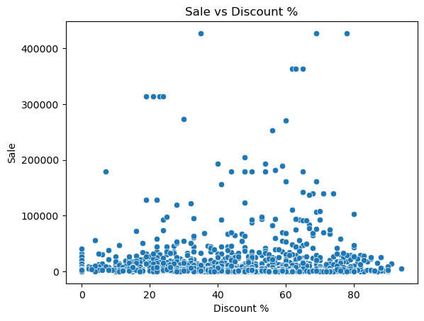
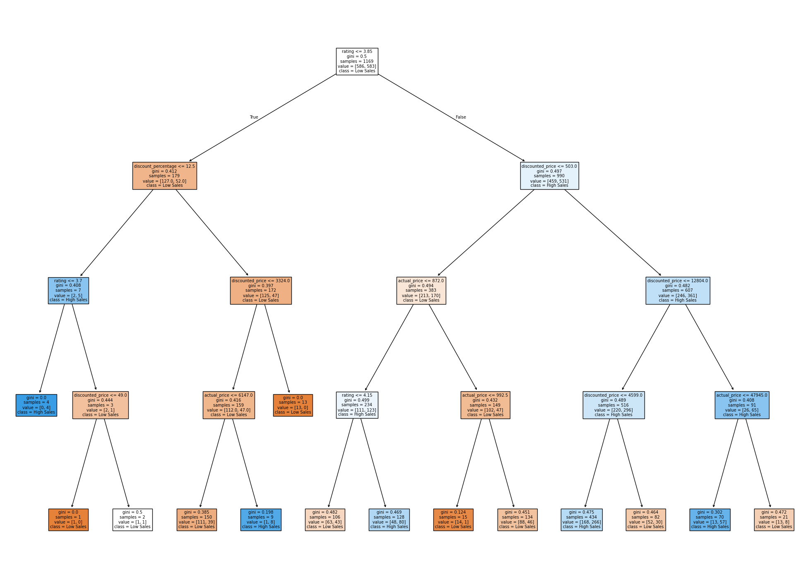
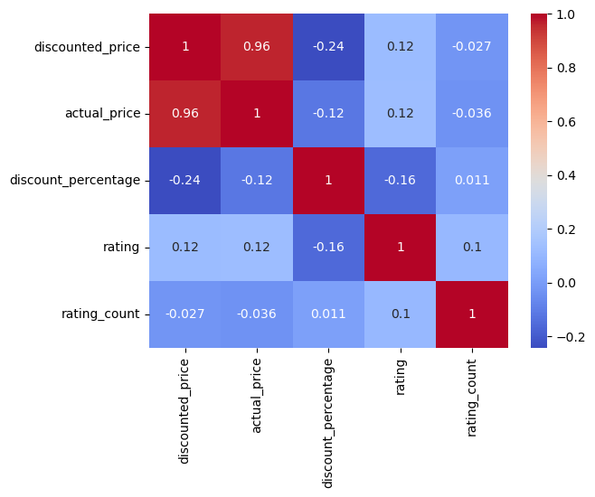

# Amazon Sales Analysis 

## Objective 📌

1.	Analyzing e-commerce product data to understand how pricing, discounts, and product categories influence customer ratings and reviews.
2.	Finding the most/least sold, profitable products.
The project explores relationships between price, discount percentage, product popularity, and customer feedback to identify factors associated with higher customer satisfaction.

---

## Dataset 📂

The dataset contains product-level information including:

* Price and discount details
* Product ratings and number of reviews
* Product categories and descriptions

---

##  Data Cleaning 🧹

* Removed missing or duplicated values
* Converted columns to appropriate data types
* Dropped irrelevant features such as IDs, user information, and URLs
* Predicted possible outliers and handled them

---

##  Exploratory Data Analysis (EDA) 📊

* Analyzed distribution of price, rating, and discount
* Identified relationships between variables using correlation and visualizations
* Compared high vs low sales products
* Find relations between discount, price, rating against customer reviews
* Visualized relation among more than two factors to see how they influence each other

---

##  Machine Learning 🤖

* Built a Decision Tree Classifier to predict high sales products
* Target variable: `high_sales` (1 = high sales, 0 = low sales)

### Model Performance

* Accuracy: 67.91%

---

##  Key Insights 🔑

* **Product rating is the strongest driver of sales performance.**
  Products with ratings above ~3.8 are significantly more likely to achieve high sales, indicating that customer satisfaction directly impacts demand.

* **Discounts are not vital for "High Sales.**
  Frequently seen, products with lower discounts are seen to have more sale than high-discount products. This refers that aside discount there are other factors that act to higher sale count.

* **Price sensitivity exists even for high-performing products.**
  While highly rated products generally perform well, higher prices can reduce their sales potential, indicating that competitive pricing remains critical.

* **Sales performance is influenced by a combination of factors rather than a single variable.**
  The decision tree model shows that rating, price, and discount interact together to determine outcomes, highlighting the need for a balanced strategy.

* **Strategic implication for businesses.**
  Companies should prioritize maintaining high product ratings while using targeted discount strategies and competitive pricing to maximize sales performance.

---

##  Visualizations 📈

### 🔹 Discount vs Sales

Discount Percentage does not provide guarantee to higher sale or lower sale.

---

### 🔹 Decision Tree Model

This model shows that product rating is the most important factor influencing sales, followed by price and discount.

---

### 🔹 Correlation Heatmap

The heatmap highlights relationships between numerical features, showing how rating and price variables relate to sales performance.

---

## 🚀 Conclusion

This project demonstrates how data analysis and machine learning can be used to extract actionable insights from e-commerce data and support business decision-making.

---

## 🛠️ Tools & Technologies

* Python
* Pandas, NumPy
* Matplotlib, Seaborn
* Scikit-learn

---

## 📎 Project Structure

* notebooks/ → analysis and modeling
* data/ → dataset
* images/ → visualizations

